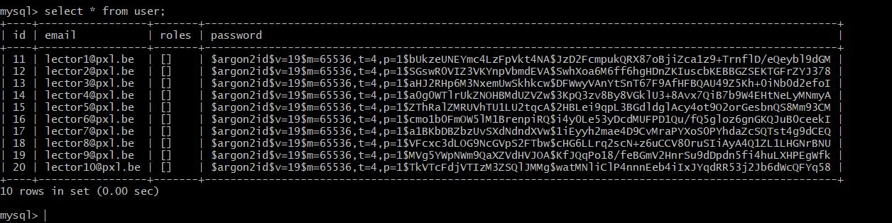

# Web & Mobile: WP2

## Create Users

We will use a database Users to store our users with roles administrators,
moderators and custodians. First, set your database connection string in the
.env file:

Then, run the following command, which will create the Users database:

To create the Users class ( for which we will later provide theAdministrator, 
Moderator and Custodian roles) we can use the Symfony MakerBundle:

This will create a User class  with a unique field 'email' and a hashed password. 
This entity will be managed by Doctrine.

To enable the pdo_mysql driver Doctrine uses to create migrations,
navigate to the php.ini file in the directory where your PHP installation
is located on your host machine, and uncomment the following line:

Now, run the following command to create the first migration to the
Users database, which will create the tables for our users:

Finally, we can migrate this initial migration using the following command:

he really neat thing about Symfony's security system is that it doesn't care at all about
what your User class looks like. As long as it implements UserInterface, so, as long as it
has these methods, you can do anything you want with it. This means you can add as nany custom
fields to it as you wish, using the 'php bin/console make:entitiy' to update the User class'fields.
Since these fields won't be necessary for what we're going to do in this project, we won't do that.

## The "User Provider"

A "User Provider" is a class that helps with specific user features such as
reloading the user data from the session, as well as other features such as 
"remember me" feature and impersonation. If you've followed the steps above,
there's no need to add anything, because Symfony added the User Provider annotation
in the security.yaml file:

## Adding dummy users

To create some dummy Users to our database we'll use the orm-fixture package for the Symfony
MakerBundle, so add that package using the following command:

 

Now, we can generate a UserFixture class, which will generate the dummy Users for us. Enter the
following command in your console: 

In this newly generated UserFixture class we'll generate 10 new users, and persist them in the database:

Now, by using the 'php bin/console doctrine:fixtures:load' command, we persist our 10 generated Users into
the database. You can check whether it worked by querying your database:

## Security Controller

For authentication purposes, we add a Symfony Controller class, called SecurityController:

 

After this, we change the index action on the SecurityController to login, and we change the index.html.twig
template name in templates/security to login.html.twig.

## Setup of security.yaml

The security.yaml file is the beating heart of our authentication system:

Firstly, this file is configured to encrypt User passwords using the most secure algorithm available at the time.
Next, the User provider is listed, a class that helps with a few things, like reloading the User data from the session
and some optional features, like "remember me" and impersonation.
 
The firewall section consists of two subsections. The 'dev' part is not very important. Basically,
it's only used to ensure the Symfony Profiler is not blocked while in a development environment. The
'main' section, however, states anonymous users are allowed to access the resources, logging in is done
through the login action on SecurityController, which is secured through a CSRF token, and a successful
login is redirected to the HomeController's home action. Logging out will invoke the SecurityController's
logout action, and redirect to the home action on the HomeController.

## Roles for our users

Since we to differentiate between anonymous users on one hand, and administrators, moderators and custodians on the
other, we have to add roles to the registered Users. We can do this, by setting the role using the setRoles function on
the User object. Let's use the load function on the UserFixture class to load some administrators, moderators and
custodians into the Users database:

Now, when we select all Users in the user table of the database, we can see the roles for all registered users:

One thing to keep in mind regarding user roles is that every registered user by default has the role ROLE_USER, which
isn't maintained in the database but rather added to the roles array on a User object every time the getRoles function
on a User object is called:

## Authorization

To make sure only admins can access admin resources, only mods can access mod resources and custodians can only access
custodian resources, you can add an access control list, or ACL, at the end of your security.yaml file:

## Credits
Peter Janssen & Ben Merken @ Hogeschool PXL, 2019.